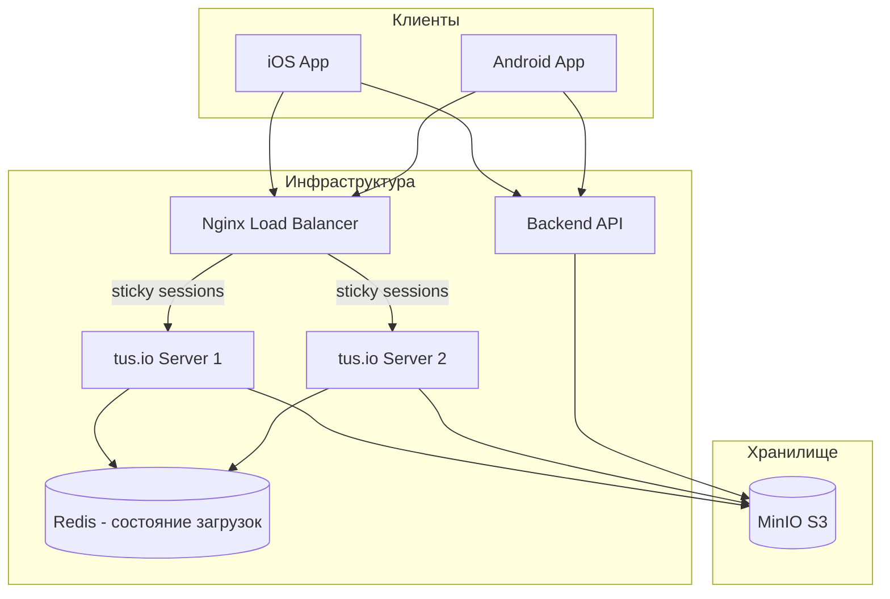
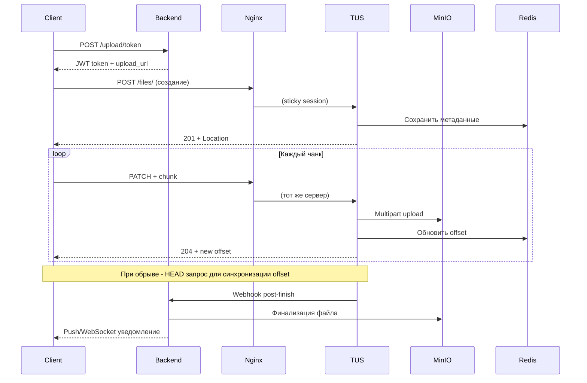

# Техническое задание: Загрузка файлов в MinIO через tus.io

## Архитектура системы



---

## 1. DevOps: Настройка инфраструктуры

### 1.1 Nginx конфигурация (КРИТИЧНО)

**ОБЯЗАТЕЛЬНО sticky sessions** - без них возобновление загрузки сломается:

```nginx
upstream tus_servers {
    ip_hash;  # или sticky cookie
    server tus1.internal:1080;
    server tus2.internal:1080;
    keepalive 32;
}

server {
    listen 443 ssl http2;
    server_name upload.example.com;
    
    client_max_body_size 0;  # Без лимита - tus сам контролирует
    proxy_request_buffering off;  # КРИТИЧНО для chunked uploads
    proxy_buffering off;
    
    # Увеличенные таймауты для плохого интернета
    proxy_connect_timeout 60s;
    proxy_send_timeout 300s;
    proxy_read_timeout 300s;
    send_timeout 300s;
    
    location /files/ {
        proxy_pass http://tus_servers;
        proxy_http_version 1.1;
        proxy_set_header Host $host;
        proxy_set_header X-Real-IP $remote_addr;
        proxy_set_header X-Forwarded-For $proxy_add_x_forwarded_for;
        proxy_set_header X-Forwarded-Proto $scheme;
        
        # tus.io специфичные заголовки
        proxy_set_header Tus-Resumable $http_tus_resumable;
        proxy_set_header Upload-Length $http_upload_length;
        proxy_set_header Upload-Offset $http_upload_offset;
        proxy_set_header Upload-Metadata $http_upload_metadata;
        
        # CORS
        add_header Access-Control-Allow-Origin *;
        add_header Access-Control-Allow-Methods "GET, POST, PATCH, DELETE, HEAD, OPTIONS";
        add_header Access-Control-Allow-Headers "Authorization, Content-Type, Upload-Length, Upload-Offset, Tus-Resumable, Upload-Metadata, Upload-Defer-Length, Upload-Concat";
        add_header Access-Control-Expose-Headers "Upload-Offset, Location, Upload-Length, Tus-Version, Tus-Resumable, Tus-Max-Size, Tus-Extension";
        
        if ($request_method = OPTIONS) {
            return 204;
        }
    }
}
```


### 1.2 tusd конфигурация

```yaml
# tusd config для каждого сервера
tusd:
  host: "0.0.0.0"
  port: 1080
  base-path: "/files/"
  
  # S3/MinIO storage
  s3-bucket: "uploads"
  s3-endpoint: "http://minio.internal:9000"
  s3-object-prefix: "tus-uploads/"
  
  # КРИТИЧНО: Redis для shared state между серверами
  # Без этого возобновление на другом сервере невозможно
  hooks-enabled-events: "pre-create,post-finish,post-terminate"
  
  # Лимиты
  max-size: 1073741824  # 1GB в байтах
  
  # Расширения tus
  enable-experimental-protocol: false
```


### 1.3 Redis для общего состояния

**ОБЯЗАТЕЛЬНО** использовать общее хранилище метаданных:

```bash
# tusd с Redis locker (предотвращает race conditions)
tusd -s3-bucket uploads \
     -s3-endpoint http://minio:9000 \
     -locker redis \
     -redis-url redis://redis:6379/0
```


### НЕЛЬЗЯ (DevOps):

- Использовать локальное файловое хранилище для метаданных при 2+ серверах
- Отключать sticky sessions при балансировке
- Устанавливать `proxy_request_buffering on`
- Использовать короткие таймауты (< 60s для connect, < 300s для read/send)

---

## 2. Backend: API и интеграция

### 2.1 Получение токена для загрузки

```javascript
POST /api/v1/upload/token
Authorization: Bearer <user_jwt>

Request:
{
    "filename": "video.mp4",
    "file_size": 524288000,
    "content_type": "video/mp4",
    "metadata": {
        "user_id": "uuid",
        "purpose": "avatar|post|message"
    }
}

Response:
{
    "upload_token": "jwt_token_for_tus",  // Короткоживущий JWT (15 мин)
    "upload_url": "https://upload.example.com/files/",
    "expires_at": "2026-01-05T12:15:00Z",
    "upload_id": "uuid",  // Для отслеживания
    "chunk_size_recommended": 524288  // 512KB для плохого интернета
}
```


### 2.2 JWT payload для tus

```json
{
    "sub": "user_uuid",
    "upload_id": "upload_uuid",
    "max_size": 1073741824,
    "allowed_types": ["image/*", "video/*", "audio/*"],
    "bucket": "uploads",
    "path_prefix": "users/uuid/",
    "exp": 1736078100,
    "iat": 1736077200
}
```


### 2.3 Webhook от tusd (post-finish)

```javascript
POST /api/v1/upload/complete
X-Hook-Name: post-finish

{
    "Upload": {
        "ID": "tus_upload_id",
        "Size": 524288000,
        "Offset": 524288000,
        "MetaData": {
            "filename": "video.mp4",
            "filetype": "video/mp4",
            "upload_token": "..."
        },
        "Storage": {
            "Type": "s3store",
            "Bucket": "uploads",
            "Key": "tus-uploads/tus_upload_id"
        }
    }
}
```


### 2.4 Backend обработка завершения

1. Валидация JWT из метаданных
2. Проверка MIME-type файла (magic bytes, не доверять заголовкам!)
3. Перемещение файла в финальный bucket/path
4. Генерация thumbnails для изображений/видео (async)
5. Обновление БД
6. Уведомление клиента через WebSocket/Push

### НЕЛЬЗЯ (Backend):

- Доверять Content-Type из заголовков — проверять magic bytes
- Выдавать долгоживущие upload токены (max 15-30 минут)
- Хранить файлы в корне bucket без структуры
- Обрабатывать webhooks синхронно (использовать очередь)
- Игнорировать валидацию размера файла

---

## 3. iOS: Реализация клиента

### 3.1 Рекомендуемая библиотека

**TUSKit** (https://github.com/tus/TUSKit) или собственная реализация на URLSession

### 3.2 Конфигурация для плохого интернета

```swift
struct TUSConfig {
    // КРИТИЧНО: маленькие чанки для плохого интернета
    static let chunkSize: Int = 512 * 1024  // 512 KB
    
    // Агрессивные retry
    static let maxRetries: Int = 10
    static let retryDelays: [TimeInterval] = [1, 2, 4, 8, 16, 32, 60, 120, 240, 300]
    
    // Таймауты
    static let requestTimeout: TimeInterval = 60
    static let resourceTimeout: TimeInterval = 300
}
```


### 3.3 Обработка сетевых проблем

```swift
class TUSUploader {
    
    func upload(file: URL, metadata: UploadMetadata) async throws -> String {
        // 1. Получить токен от backend
        let token = try await api.getUploadToken(for: file)
        
        // 2. Проверить, есть ли незавершенная загрузка
        if let resumableURL = storage.getResumableUpload(fileHash: file.sha256Hash) {
            return try await resumeUpload(url: resumableURL, file: file, token: token)
        }
        
        // 3. Создать новую загрузку
        return try await createAndUpload(file: file, token: token, metadata: metadata)
    }
    
    private func uploadChunk(
        uploadURL: URL,
        data: Data,
        offset: Int,
        token: String
    ) async throws -> Int {
        var request = URLRequest(url: uploadURL)
        request.httpMethod = "PATCH"
        request.setValue("1.0.0", forHTTPHeaderField: "Tus-Resumable")
        request.setValue("\(offset)", forHTTPHeaderField: "Upload-Offset")
        request.setValue("application/offset+octet-stream", forHTTPHeaderField: "Content-Type")
        request.setValue("Bearer \(token)", forHTTPHeaderField: "Authorization")
        request.httpBody = data
        
        // Retry logic с exponential backoff
        var lastError: Error?
        for attempt in 0..<TUSConfig.maxRetries {
            do {
                let (_, response) = try await session.data(for: request)
                guard let httpResponse = response as? HTTPURLResponse else {
                    throw TUSError.invalidResponse
                }
                
                switch httpResponse.statusCode {
                case 204:
                    let newOffset = httpResponse.value(forHTTPHeaderField: "Upload-Offset")
                    return Int(newOffset ?? "0") ?? offset
                case 409:
                    // Conflict - нужно получить актуальный offset
                    throw TUSError.conflictNeedResync
                case 404:
                    // Upload не найден - нужно создать заново
                    throw TUSError.uploadNotFound
                default:
                    throw TUSError.serverError(httpResponse.statusCode)
                }
            } catch {
                lastError = error
                
                // Не retry для фатальных ошибок
                if case TUSError.uploadNotFound = error { throw error }
                if case TUSError.conflictNeedResync = error { throw error }
                
                // Exponential backoff
                let delay = TUSConfig.retryDelays[min(attempt, TUSConfig.retryDelays.count - 1)]
                try await Task.sleep(nanoseconds: UInt64(delay * 1_000_000_000))
            }
        }
        throw lastError ?? TUSError.maxRetriesExceeded
    }
}
```


### 3.4 Сохранение состояния для возобновления

```swift
// Сохранять в UserDefaults/Keychain:
struct ResumableUpload: Codable {
    let uploadURL: String
    let fileHash: String  // SHA256 файла
    let filePath: String
    let totalSize: Int
    let lastOffset: Int
    let createdAt: Date
    let expiresAt: Date
}
```


### НЕЛЬЗЯ (iOS):

- Использовать чанки > 1MB при плохом интернете
- Игнорировать Upload-Offset из ответа сервера
- Retry без exponential backoff (забьёте сервер)
- Загружать в main thread
- Хранить upload URL без привязки к hash файла
- Игнорировать background upload capabilities
- Делать retry при 4xx ошибках (кроме 409, 423)

---

## 4. Android: Реализация клиента

### 4.1 Рекомендуемая библиотека

**tus-android-client** (https://github.com/tus/tus-android-client) или OkHttp-based реализация

### 4.2 Конфигурация

```kotlin
object TUSConfig {
    // Маленькие чанки для плохого интернета
    const val CHUNK_SIZE = 512 * 1024  // 512 KB
    
    // Retry
    const val MAX_RETRIES = 10
    val RETRY_DELAYS = listOf(1, 2, 4, 8, 16, 32, 60, 120, 240, 300) // секунды
    
    // Таймауты OkHttp
    const val CONNECT_TIMEOUT = 60L
    const val READ_TIMEOUT = 120L
    const val WRITE_TIMEOUT = 120L
}
```


### 4.3 Реализация с WorkManager (для фоновой загрузки)

```kotlin
class TUSUploadWorker(
    context: Context,
    params: WorkerParameters
) : CoroutineWorker(context, params) {

    override suspend fun doWork(): Result {
        val filePath = inputData.getString("file_path") ?: return Result.failure()
        val uploadToken = inputData.getString("upload_token") ?: return Result.failure()
        
        return try {
            val uploader = TUSUploader(applicationContext)
            val result = uploader.upload(
                file = File(filePath),
                token = uploadToken,
                chunkSize = TUSConfig.CHUNK_SIZE,
                onProgress = { offset, total ->
                    setProgress(workDataOf(
                        "offset" to offset,
                        "total" to total
                    ))
                }
            )
            Result.success(workDataOf("upload_url" to result))
        } catch (e: TUSRetryableException) {
            if (runAttemptCount < TUSConfig.MAX_RETRIES) {
                Result.retry()
            } else {
                Result.failure()
            }
        } catch (e: Exception) {
            Result.failure()
        }
    }
}
```


### 4.4 Network callback для возобновления

```kotlin
class NetworkChangeReceiver : BroadcastReceiver() {
    override fun onReceive(context: Context, intent: Intent) {
        if (isNetworkAvailable(context)) {
            // Возобновить прерванные загрузки
            TUSUploadManager.resumePendingUploads(context)
        }
    }
}
```


### НЕЛЬЗЯ (Android):

- Использовать чанки > 1MB при плохом интернете
- Загружать без WorkManager/Service (убьёт система)
- Игнорировать Doze mode и App Standby
- Хранить состояние только в памяти
- Использовать синхронные вызовы в main thread
- Игнорировать Network Security Config для production
- Делать retry при 4xx ошибках (кроме 409, 423)

---

## 5. Общие рекомендации

### 5.1 Размер чанков (КРИТИЧНО для плохого интернета)

| Качество сети | Рекомендуемый размер чанка |

|---------------|---------------------------|

| Плохое (2G/Edge) | 256 KB |

| Среднее (3G) | 512 KB |

| Хорошее (4G/WiFi) | 1-5 MB |**Рекомендация:** Адаптивный размер чанка на основе скорости:

```javascript
if (currentSpeed < 100 KB/s) chunkSize = 256KB
else if (currentSpeed < 500 KB/s) chunkSize = 512KB
else chunkSize = 1MB
```


### 5.2 Обязательные заголовки tus

| Заголовок | Описание |

|-----------|----------|

| `Tus-Resumable: 1.0.0` | Версия протокола (обязательно) |

| `Upload-Length` | Полный размер файла (при создании) |

| `Upload-Offset` | Текущий offset (при PATCH) |

| `Upload-Metadata` | Base64 метаданные |

| `Authorization` | JWT токен |

### 5.3 Коды ответов tus

| Код | Действие |

|-----|----------|

| 201 | Создано - сохранить Location header |

| 204 | Чанк принят - продолжить |

| 409 | Conflict offset - запросить HEAD и пересинхронизировать |

| 410 | Gone - загрузка удалена, создать заново |

| 423 | Locked - подождать и retry |

| 404 | Не найдено - создать заново |

### 5.4 Flow загрузки



---

## 6. Чеклист перед запуском

### DevOps:

- [ ] Sticky sessions настроены в Nginx
- [ ] `proxy_request_buffering off` установлен
- [ ] Redis для shared state между tusd серверами
- [ ] Таймауты увеличены (300s+)
- [ ] Мониторинг tusd серверов (Prometheus)
- [ ] Логирование upload ID для дебага

### Backend:

- [ ] Валидация файлов по magic bytes
- [ ] Короткоживущие JWT для upload (15 мин)
- [ ] Webhook обработка через очередь
- [ ] Rate limiting на создание uploads
- [ ] Cleanup старых незавершённых uploads (cron)

### Mobile (iOS/Android):

- [ ] Chunk size 512KB по умолчанию
- [ ] Exponential backoff retry (до 10 попыток)
- [ ] Сохранение состояния для возобновления
- [ ] Background upload support
- [ ] Индикатор прогресса с offset синхронизацией